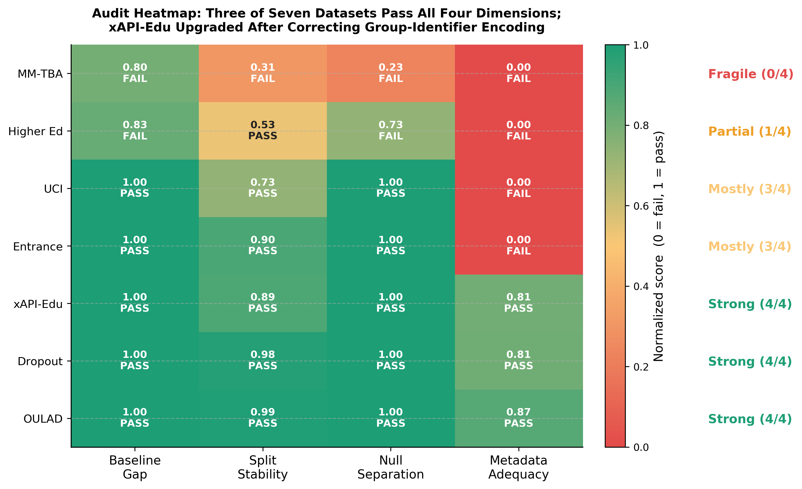

# BehaviorAudit

**Are educational prediction benchmarks structurally reliable enough to support generalizable modeling claims?** This repository implements a four-dimension pre-modeling audit protocol that answers: **mostly no.** Across seven public educational datasets, three pass all four reliability checks (OULAD, Dropout, xAPI-Edu); the remaining four fail—most on metadata adequacy and cross-group generalization. The audit runs a standardized pipeline of baseline-gap, split-instability, permutation-null, and group-aware holdout checks before any model optimization, serving as a quality gate for educational AI benchmarks.

This repository accompanies the manuscript by Yan Ma and Lizhuo Zhang (revised version submitted to *Scientific Reports*).

## Key Findings (TL;DR)

| Dimension | What it tests | Passing rate |
| --- | --- | --- |
| Baseline gap | Does the model beat a trivial mean predictor? | 6 / 7 |
| Split instability | Are conclusions stable across random partitions? | 6 / 7 |
| Null separation | Does observed performance separate from permuted labels? | 5 / 7 |
| Metadata adequacy | Does performance survive group-aware holdout? | 3 / 6 (one untestable) |

- **3 Strong** profiles: OULAD, Dropout, xAPI-Edu (pass all 4 dimensions)
- **2 Mostly Passing**: UCI Student, Entrance Exam (fail only group holdout)
- **1 Partial**: Higher Ed (fails 3 / 4)
- **1 Fragile**: MM-TBA (fails all 4; no grouping metadata available)

The dominant failure mode is **cross-group fragility**—not weak iid performance. Models that look useful under random splitting can become worse than a mean predictor when transferred to unseen schools, courses, or cohorts.



## Repository Layout

| Path | Purpose |
| --- | --- |
| `framework/` | Dataset adapters, baseline models, metrics, and the lightweight audit runner. |
| `run_7dataset_audit.py` | Full four-dimension audit that produced the main manuscript results. |
| `run_classification_sensitivity.py` | Classification-metric sensitivity check for binary/ordinal targets. |
| `run_audit.py` | Quick single-dataset adapter runner for smoke tests and small reruns. |
| `generate_figures.py` | Regenerates manuscript figures from tracked result artifacts (no audit rerun needed). |
| `scripts/` | Helper scripts for structural-pattern analysis, split-level metrics, and supplementary tables. |
| `diagnostics/` | Tracked per-split CSV artifacts consumed by figure-generation scripts. |
| `paper/` | LaTeX source files for the manuscript (compiled PDF available in the Zenodo archive). |

## Installation

Tested on Python 3.8+. Use a virtual environment:

```bash
python3 -m venv .venv
source .venv/bin/activate
python3 -m pip install -r requirements.txt
```

## Dataset Placement

Raw datasets are **not** redistributed in this repository. The pipeline expects them under `datasets/` as shown below:

| Dataset | Expected path |
| --- | --- |
| MM-TBA | `datasets/MM-TBA/` |
| Higher Ed (UCI ID 856) | `datasets/StudentExam/higher_ed_856.csv` |
| xAPI-Edu | `datasets/xAPI-Edu/xAPI-Edu-Data.csv` |
| Entrance Exam (UCI ID 582) | `datasets/StudentExam/student_entrance_582.csv` |
| UCI Student (UCI ID 320) | `datasets/UCI/student-por.csv` (also accepts `student-mat.csv`) |
| Student Dropout (UCI ID 697) | `datasets/StudentDropout/student_dropout.csv` |
| OULAD | `datasets/OULAD/*.csv` |

### Automated Download

```bash
bash scripts/download_datasets.sh
```

Downloads each dataset from its original source. See dataset-specific licenses below.

### Upstream Sources and Licensing

| Dataset | Source | License |
| --- | --- | --- |
| MM-TBA | <https://doi.org/10.1038/s41597-025-05426-6> | Not redistributed. Obtain from the authors. |
| Higher Ed | <https://archive.ics.uci.edu/dataset/856/higher+education+students+performance+evaluation> | CC BY 4.0 (UCI) |
| xAPI-Edu | <https://www.kaggle.com/datasets/aljarah/xAPI-Edu-Data> | CC BY-SA 4.0 (Kaggle) |
| Entrance Exam | <https://archive.ics.uci.edu/dataset/582/student+performance+on+an+entrance+examination> | CC BY 4.0 (UCI) |
| UCI Student | <https://archive.ics.uci.edu/dataset/320/student+performance> | CC BY 4.0 (UCI) |
| Student Dropout | <https://archive.ics.uci.edu/dataset/697/predict+students+dropout+and+academic+success> | CC BY 4.0 (UCI) |
| OULAD | <https://doi.org/10.1038/sdata.2017.171> | Follow upstream terms |

## Reproduction

### A) Reproduce Figures Only (Fastest — No Audit Rerun Needed)

All result artifacts are tracked in the repository. To regenerate every figure from the pre-computed JSON/CSV:

```bash
python3 generate_figures.py
python3 scripts/structural_pattern_analysis.py
```

Outputs land in `outputs/`. The figures match those in the manuscript.

### B) Reproduce the Full Audit (Requires Local Datasets)

**Step 1 — Main audit:**
```bash
python3 run_7dataset_audit.py
```
Writes `audit_7dataset_results.json` (100 repeated 80/20 splits per dataset, 30 permutation-tested splits with 500 draws each, leave-one-group-out validation).

**Step 2 — Classification sensitivity:**
```bash
python3 run_classification_sensitivity.py
```
Writes `classification_sensitivity_results.json`.

**Step 3 — Structural-pattern analysis:**
```bash
python3 scripts/structural_pattern_analysis.py
```
Writes `outputs/fig5_structural_patterns.pdf` and `outputs/structural_pattern_analysis.csv`.

**Step 4 — Linear split metrics (for distribution plots):**
```bash
python3 scripts/export_linear_split_r2.py
python3 scripts/merge_linear_metrics.py
```

**Step 5 — Regenerate figures from fresh results:**
```bash
python3 generate_figures.py
```

### C) Smoke Test

Verify the adapter framework works with a single dataset on a few splits:

```bash
python3 run_audit.py --dataset uci_student --seeds 0 1 --n-permutations 2 --output-dir diagnostics/smoke_uci
```

Supported datasets: `mm_tba`, `higher_ed`, `xapi_edu`, `entrance_exam`, `uci_student`, `student_dropout`, `oulad`.

## Methodological Note: Group-Column Correction

During the audit, we discovered that three datasets (UCI Student, xAPI-Edu, Entrance Exam) encode group membership as one-hot features in the original feature matrix. When left-one-group-out holdout is applied, the held-out group's indicator column becomes **zero-variance** in the training partition, causing spurious linear-model collapse (e.g., xAPI-Edu appeared to have group-holdout $R^2 = -2.03$). The pipeline automatically detects and excludes group-identifier columns before group-aware training:

```python
if bundle.group_column_indices:
    X_gh = np.delete(X, bundle.group_column_indices, axis=1)
```

After correction, xAPI-Edu's true group-holdout $R^2$ is **0.484** (retention 81%), reclassifying it from Mostly Passing (3/4) to **Strong (4/4)**. This correction is implemented in both `run_7dataset_audit.py` and `run_classification_sensitivity.py`. New datasets should report `group_column_indices` in their adapter to benefit from this safeguard (see `framework/adapters/xapi_edu.py` for an example).

## Citation

```bibtex
@article{ma2026audit,
  title={Are Educational Prediction Benchmarks Structurally Reliable?
         A Four-Dimension Audit Across Seven Public Datasets},
  author={Ma, Yan and Zhang, Lizhuo},
  year={2026}
}
```

Code DOI: <https://doi.org/10.5281/zenodo.20754475>

## License

Code: MIT License. See `LICENSE`. Dataset licenses are as specified by each upstream source.